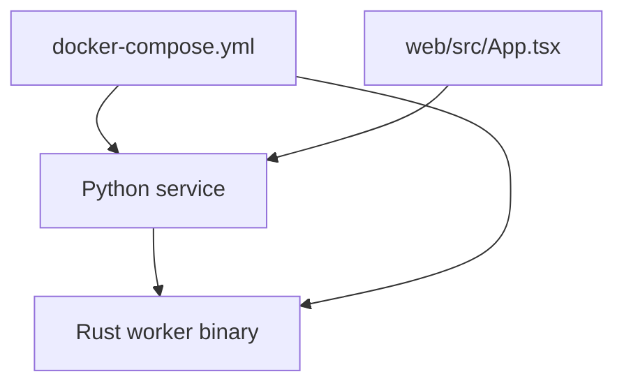

# Architecture Notes

The fixture has three coarse areas:

1. a Python service under `src/python_app/`;
2. a Rust helper crate under `rust/`;
3. a web shell under `web/` that Lithograph should treat through generic text
   fallback until TypeScript support exists.



Run checks from the repository root:

```sh
make test
cargo test --manifest-path rust/Cargo.toml
python -m pytest
```

